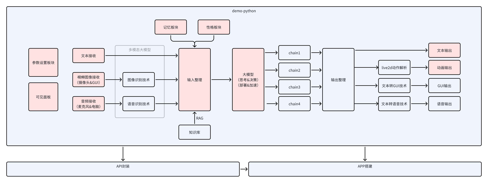

# 零音：一款更前沿的AI Vtuber框架


## Table of Contents
- [项目概述](#项目概述)
- [环境配置](#环境配置)
- [使用方法](#使用方法)
- [项目结构](#项目结构)
- [贡献者](#贡献者)

## 项目概述
[零音]是一款更前沿的AI Vtuber数字人直播框架，其在具有通用特性的基础上，更加追求拟人程度和灵活性。

项目的结构如下图所示：




## 环境配置
新建一个项目环境
```
conda create -n lingyin python=3.10
```
进入环境
```
conda activate lingyin
```
安装相关库
```
pip install -r requirements.txt
```
执行主程序
```
python main.py
```

## 使用方法
### 超参数配置
当前版本下，在config.yaml中提供了诸多可调节的参数，部分细节如下：

（1）是否开启虚拟人的各部分“感官”监控：

文本监控——is_text

摄像头图像监控——is_pic

GUI图像监控——is_gui

麦克风音频监控——is_micro

电脑音频监控——is_voice

（2）监控时采样时间

摄像头图像间隔时间——pic_interval_time

GUI图像间隔时间——gui_interval_time

麦克间隔——micro_interval_time

电脑音间隔时间——voice_interval_time

（3）前端展示

窗口尺寸 pic_width&gui_width : pic_height : gui_height 

27寸屏幕——>720:520：420

24寸屏幕——>540:390:315


## 项目结构

**代码结构细节详见 project_structure.txt**

chain/：主函数运行后，会在此选择执行链

forward_module/:：程序运行时正向推理全部模块，如监控信息、思考推理、动作输出、ui展示等

backstage_module/： 正向推理外的其他模块，包括如性格、记忆、模型更新等逻辑

log/：日志系统，记录了对话中的性格、历史等信息的变化

src/：资源辅助，如大模型、prompt和其他工具都在这里封装

main.py：可运行的主函数

config.yaml：超参数配置文件

## 贡献者
宋世杰、陶世杰、蔡琰凯

联系方式：微信号 emoaira666


